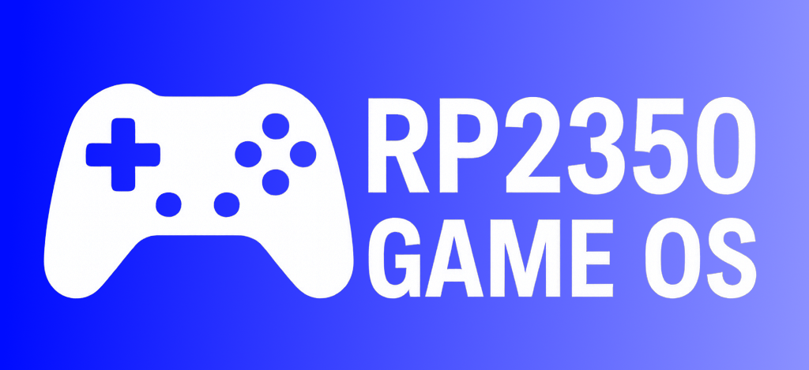

# 🎮 RP2350 Console and Game OS

Welcome to the **RP2350 Console and Game OS** project — an open platform for building a retro-style game console using the powerful [RP2350 SoC](https://datasheets.raspberrypi.com/rp2350/rp2350-datasheet.pdf).

This project aims to build a reusable, lightweight **game operating system** with support for loading and running games from external storage, real-time video/audio output, and network capabilities.

---

## 🧩 Hardware Overview

| Component         | Details                             |
|------------------|-------------------------------------|
| **CPU**          | RP2350 (Cortex-M33 dual-core)       |
| **Flash**        | 16 MB QSPI                          |
| **RAM**          | 8 MB PSRAM                          |
| **Video Output** | HDMI (DVI-compatible TMDS)          |
| **Audio Output** | 3.5mm analog jack (PWM or I2S DAC)  |
| **Storage**      | microSD card slot                   |
| **Connectivity** | Wi-Fi and Ethernet                  |
| **USB Ports**    | 1 or 2 USB ports (for gamepad input)|

---

## 🧠 Project Goals

- 🧪 **Reusable OS kernel** with a game-focused syscall (SVC) API
- 🖥️ **Launcher UI** for selecting and running games
- 🔧 **SVC-based API** for:
  - File and asset access
  - Video (tile maps, sprites, framebuffers)
  - Audio (PCM, music, SFX)
  - Text rendering
- 🌐 **Self-updating OS** over the internet
- 💾 **SD card-based game loading**
- 🧱 **2D game engine foundation** (tilemaps, sprites, palette handling)
- 🧰 **Developer tools and SDK**
- 🕹️ Support for basic **2D games**, with potential **3D features** later

---

## 📅 Roadmap

| Feature                     | Status        |
|-----------------------------|---------------|
| Kernel + bootloader         | 🚧 Planned   |
| HDMI framebuffer            | 🚧 Planned   |
| Audio output                | 🚧 Planned   |
| SD card FAT32 support       | 🚧 Planned   |
| Launcher UI                 | 🚧 Planned   |
| Game binary format          | 🚧 Planned   |
| SVC-based game API          | 🚧 Planned   |
| 2D tilemap + sprite system  | 🚧 Planned   |
| Internet update mechanism   | 🚧 Planned   |
| Wi-Fi/Ethernet support      | 🚧 Planned   |
| USB gamepad input           | 🚧 Planned   |
| Design a custom PCB         | 🚧 Planned   |

Legend:
* 🚧 Planned
* 🧪 In design
* 🔧 In progress
* ✅ Done
* ❌ Future

---

## 📁 Project Structure Overview

- `os/` – Core OS: syscall dispatch, drivers
- `ui/` – Launcher UI code  
- `games/` – Demo games and loading logic  
- `lib/` – Shared libraries for game developers  
- `tools/` – Build scripts, asset converters, etc.  
- `docs/` – Design docs, block diagrams, specs  
- `pcb/` – Custom PCB design files (KiCad)

---

## 🎮 Game Development SDK

A lightweight SDK will be provided to help developers create games targeting the OS:

- Syscall wrappers (SVC-based) for accessing:  
  - Graphics (tilemaps, framebuffer)  
  - Input (USB controllers)  
  - Audio (streaming and SFX)  
  - Filesystem access (assets, saves)
- Tools to package and deploy games  

> SDK templates and tooling will be added soon.

## 🤝 Contributing

We welcome ideas, feedback, bug reports, and code contributions!

---

## 📜 License

This project is licensed under the **MIT License**. See `LICENSE` for details.

---

## 🧠 Acknowledgments

- Raspberry Pi Foundation for the RP2350 chip  
- Open-source projects that inspired the architecture (e.g. RetroArch, TinyEMU)  
- The embedded dev community  

---

## 💬 Contact

For questions, discussions, or suggestions:  
- Open an issue or pull request  
- Start a discussion in the GitHub "Discussions" tab  
